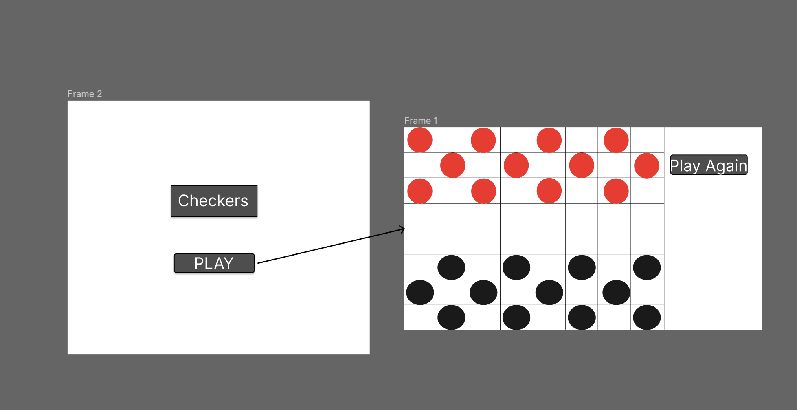

# Checkers

## Project planning for Checkers

Wireframe:

## User Stories

MVP
- As a user, I want to be able to start the game
- As a user, I want to be able to move a piece
- As a user, I want to play against someone else
- As a user, I want to take a turn
- As a user, I want to take pieces
- As a user, I want to be able to play again
- As a user, I want to know if I Lost
- As a user, I want to know if I Won
- As a user, I want to know if its my turn

Version 2
- As a user, I want to be able to change piece appearance
- As a user, I want to change board appearance

Version 3
- As a user, I want hints
- As a user, I want to play against AI
- As a user, I want a flip table option

