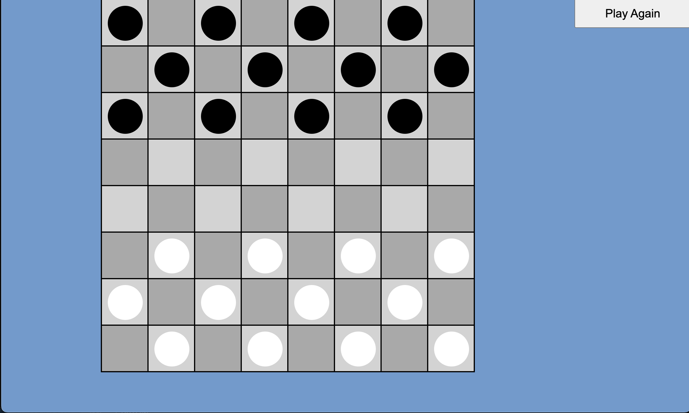

# Checkers

Checker is a game where two player try to compete for who can take the most pieces on the board. I chose because as a kid I played with my grandfather without really understanding the game and I wanted to try to make something I could show him next time I see him

## Technology Used

The following technology was used in order to create Dragon Slayer:

- JavaScript
- HTML
- CSS

## Getting Started

To play this game live you can click this [link](https://melendezj18.github.io/Project-1/)

Instructions:

- Click on the play game button on the landing page
- Once over on the game screen bring a friend or play on your own
- Black goes first
- Click on a square to move a piece to another open space
- You can only move diagonally 
- Take opposing pieces by jumping over them
- Play till the opposing side has no pieces or cant move anymore
- press Play again to reset at any time

## Next Steps

Version 2
- As a user, I want to be able to change piece appearance
- As a user, I want to change board appearance
- As a user, I want a timer for turns

Version 3
- As a user, I want hints
- As a user, I want to play against AI
- As a user, I want a flip table option
